# Hengsel-logoen og favikonet fra logopakken 09.10.2026

**Dato:** 09.10.2026
**Fasit:** `docs/design/hengsel/logo/` (logopakken «hengsel-ds-logo.zip», lastet opp 09.10.2026, `LES-MEG.md`)
**Gren:** `claude/keen-hamilton-7u3kar`

## Kort

- Logopakken lå allerede i repoet som `docs/design/hengsel/logo/` (innholdet i zip-en, byte for byte). Det finnes ingen
  mappe `docs/design/hengsel-ds/logo/`; jeg har brukt den som ligger der og ikke laget en kopi.
- Hengsel-logoen tegnes nå fra pakken på **alle tre stedene den vises**: Visningsrommet (vis.sngroup.no), hengsel.no
  og sngroup.no. Alle tre bruker samme SVG fra `packages/design/src/hengsel-logo.mjs`, så de kan ikke skli fra hverandre.
- Favikonet er byttet til pakkens `favicon.svg` + `favicon-32.png` + `apple-touch-icon-180.png` på Visningsrommet og
  hengsel.no. **sngroup.no beholder sitt eget «SN»-favikon**, se «Ikke gjort» nederst.
- SN Group-logoen er uendret overalt (toppfeltet på sngroup.no, høyre hjørne i Visningsrommet, familiebåndet).
- Hengsel-omtalen lenker til hengsel.no: Hengsel-delen på sngroup.no (logoen og en ny knapp «hengsel.no →»), og i
  Visningsrommet «Levert med [Hengsel]» i bunnen og «hengsel.no» i familiebåndet (sto som «siden du er på», uten lenke).

## Før og etter

Bildene ligger i `docs/skjermbilder/hengsel-logo/` (`*-for.png` = `main` før endringen, `*-etter.png` = denne grenen).

| Hvor | Før | Etter |
|---|---|---|
| sngroup.no, Hengsel-delen | 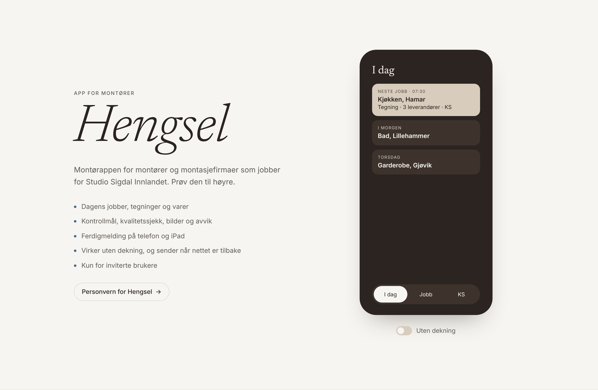 | 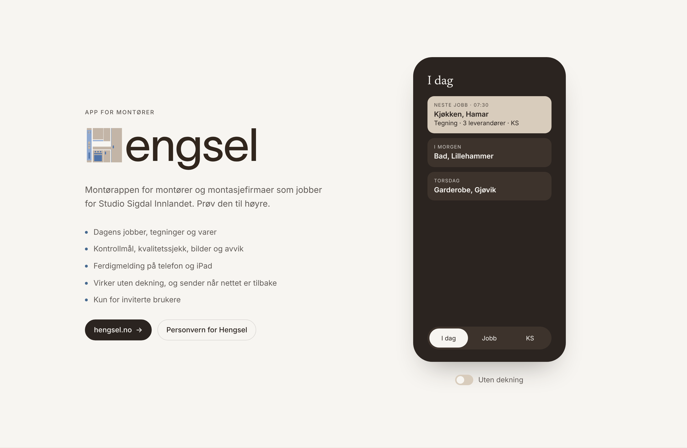 |
| sngroup.no, Hengsel-delen, mørk | 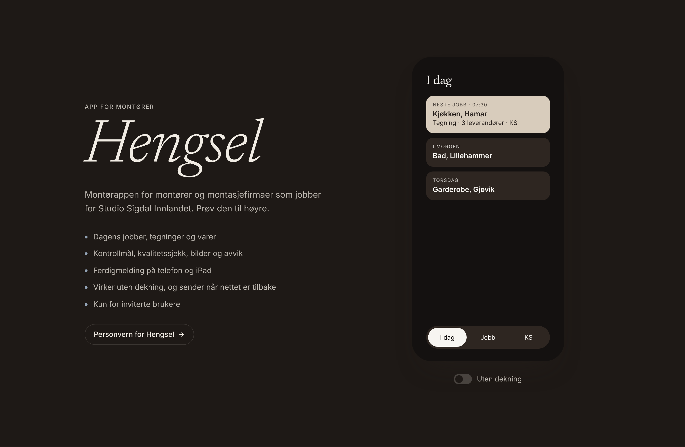 | 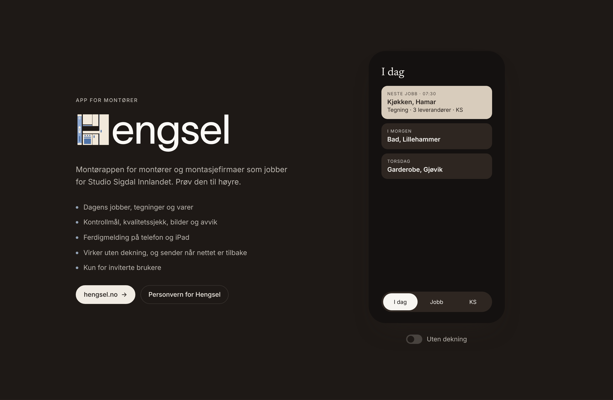 |
| sngroup.no, toppfeltet (SN Group-logoen, uendret) | 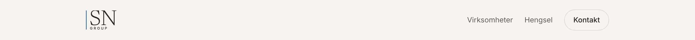 |  |
| sngroup.no/design, eksempelet på hengsel.no-toppfeltet | 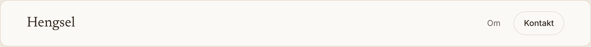 | 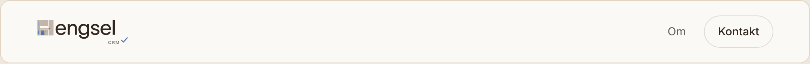 |
| hengsel.no, toppfeltet | 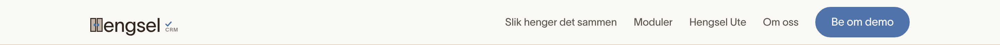 | 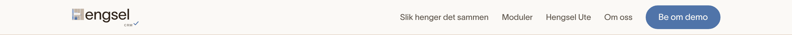 |
| hengsel.no, toppfeltet på mobil | 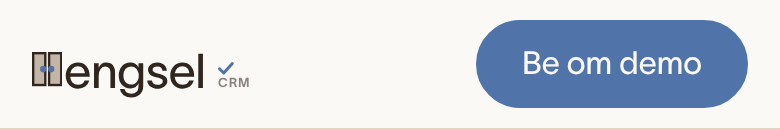 | 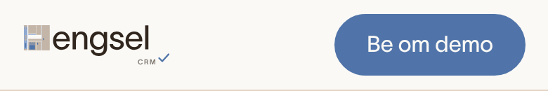 |
| Visningsrommet, toppfeltet (SN-logoen til høyre, uendret) | 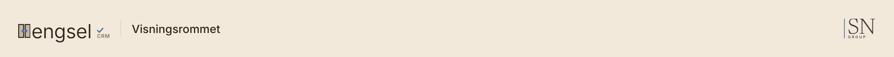 | 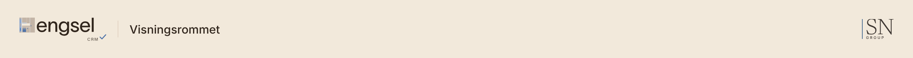 |
| Visningsrommet, toppfeltet, mørk | 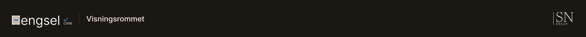 | 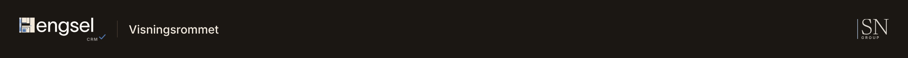 |
| Visningsrommet, bunnen («Levert med» og familiebåndet) | 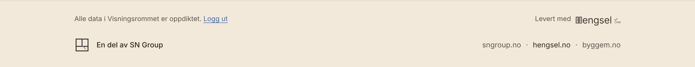 | 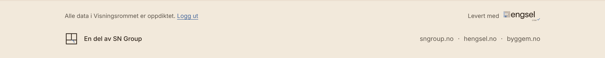 |
| Visningsrommet, Systemkartet | 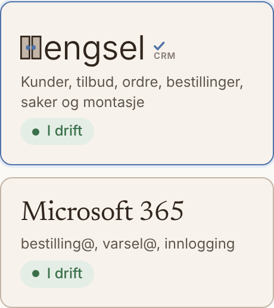 | 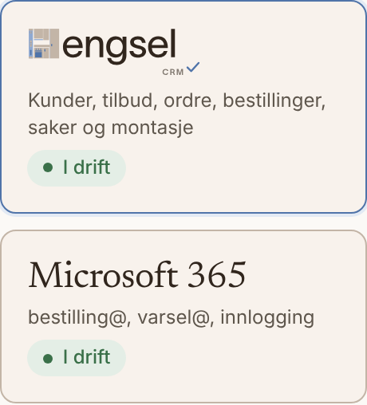 |
| Visningsrommet, menyen i «Prøv CRM selv» | 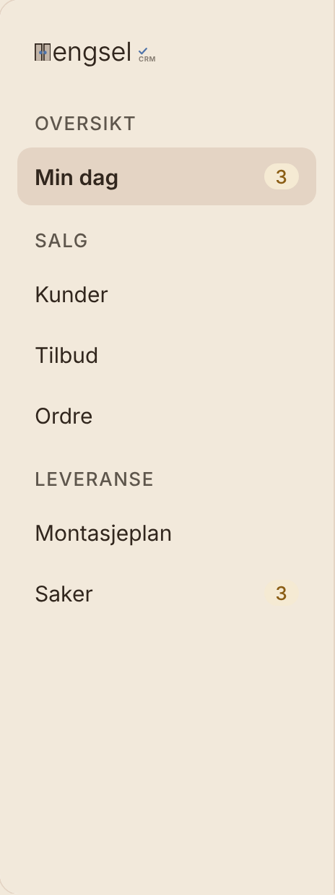 | 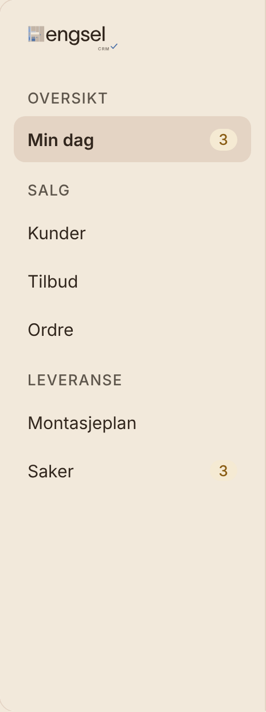 |

Favikonene (64 px, øverst før, nederst etter; sngroup.no er uendret):

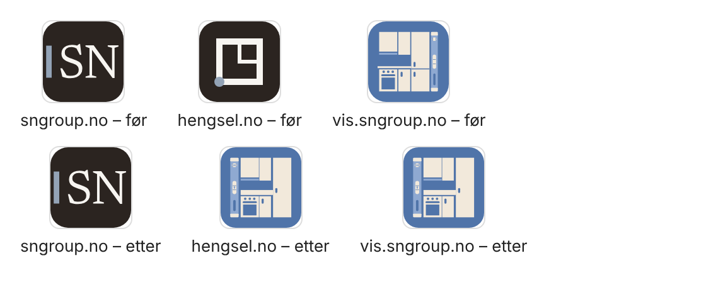

De vanlige skjermbildene i `docs/skjermbilder/` er også tatt på nytt (sngroup, hengsel og vis).

## Hva er gjort

### Logoen: én kilde for alle nettstedene

Logofilene i pakken har «engsel» og «CRM» som `<text>` i TWK Lausanne. Som bilde i nettleseren ville teksten falt
tilbake til standardskriften der Lausanne ikke er installert (sngroup.no og Visningsrommet har den ikke), og pakken
sier selv «gjør om til konturer før bruk der fonten ikke er installert». Derfor:

- `scripts/hengsel-logo-konturer.py` former teksten med HarfBuzz (kerning som i nettleseren) og tegner glyfene fra
  skriftfilene hengsel.no alt har (`sites/hengsel/public/fonts/TWKLausanne-350.woff2` og `-650.woff2`), med nøyaktig
  pakkens plassering: «engsel» 96 px fra x=80 på grunnlinje 69 med −1,5 i sperring, «CRM»/«UTE» 20 px høyrestilt mot
  x=378 på grunnlinje 112, haken `M385 94 l9 9 l18 -20`. Resultatet ligger i `packages/design/src/hengsel-logo-data.mjs`
  (merket fra `hengsel-merke-lys.svg`, ordet og produktnavnene som stier). Skriptet kjøres bare når pakken endres.
- `packages/design/src/hengsel-logo.mjs` lager SVG-en: `hengselLogo({ size, produkt: "CRM" | "UTE" | null })`. Vater
  (#8FA9D1) og Deep Blue (#5074A9) er faste; skapet, ordet og produktnavnet følger lys/mørk modus gjennom
  `--merke-skap` (Beige 1 / Krem), `--merke-ord` (Warm Black / Off White) og `--merke-produkt` (60 %), som pakken sier.
  Variablene står i `packages/design/src/styles/tokens.css`, `sites/hengsel/src/styles/tokens.css` og `sites/vis/src/assets/vis.css`.
- `packages/design/src/components/HengselLogo.astro` bruker den (sngroup.no og hengsel.no); `sites/vis/bygg.mjs`
  importerer den direkte. Den gamle `sites/hengsel/src/components/HengselLogo.astro` (H-merket med to skapdører) og
  kopien av den i `bygg.mjs` er fjernet.

### sngroup.no

- Hengsel-delen på forsiden: den store kursive overskriften «Hengsel» er byttet med logoen uten produktnavn
  (`hengsel-logo-*` i pakken), 56–96 px etter skjermbredden, som lenke til hengsel.no. Ny knapp «hengsel.no →» først,
  «Personvern for Hengsel» ved siden av. Teksten ellers er uendret. Raden «Hengsel» under Virksomheter lenket til
  hengsel.no fra før.
- `/design`: eksempelet på hengsel.no-toppfeltet viser logoen i stedet for ordet «Hengsel».
- Toppfeltet (SN Group-logoen) og favikonet er uendret.

### hengsel.no

- Toppfeltet og passordsiden for /apptest bruker den felles komponenten (28 px, 24 px under 900 px som før).
- `public/favicon.svg` er pakkens; `favicon-32.png` og `apple-touch-icon-180.png` er lagt til og lenket fra `<head>`
  (`BaseLayout` har fått `ikonPng`, `appleIkon` fantes). `theme-color` er fortsatt sidens bakgrunnsfarge.

### Visningsrommet (vis.sngroup.no)

- `<!--hengsel-logo N-->` virker som før (N er skriftstørrelsen på «engsel»); logoen er 1,25 em høy med «CRM» under
  ordet, slik pakken plasserer produktnavnet. Klassen heter fortsatt `hlogo`, så de lokale reglene i rommene gjelder.
- Favikon på alle 24 sidene: `favicon.svg`, `favicon-32.png` og `apple-touch-icon-180.png` fra pakken.
  `hengsel-app-ikon-lys/-mork.svg` (app-ikonet L9) er fjernet fra `src/`.
- Bunnen på forsiden: «Levert med [Hengsel CRM]» lenker til hengsel.no. Familiebåndet på forsiden, `/sv/` og `/en/`
  lenker til hengsel.no (sto som `aria-current="page"` uten lenke, som om man var på hengsel.no).

## Sjekket

| Sjekk | Resultat |
|---|---|
| `npm run build` | Alle fire nettstedene bygger. vis: Hengsel-logoen på 24 sider |
| `npm test` | 225 forespørsler, 0 feil |
| `npm run skjermbilder` | 0 feil: ingen vannrett rulling ved 360 px, ingen konsollfeil (CSP), ingen eksterne forespørsler |
| `npm run skjermbilder:vis` | 24 sider × 6 visninger, 0 feil |
| Lys og mørk modus | Skapet Krem og ordet Off White i mørk modus på alle tre nettstedene (bildene over) |

## Ikke gjort, og hvorfor

- **Favikonet på sngroup.no** er fortsatt «SN» med hengselstrek (`docs/design/sngroup/assets/favicon.svg`, SN Groups
  eget). Oppgaven sier «Hengsel-logo og favicon på sngroup.no», men sngroup.no hadde ingen Hengsel-logo å bytte, mens
  vis.sngroup.no hadde både Hengsel-logoen, et Hengsel-favikon og SN-logoen ved siden av. Jeg har lest det som
  Visningsrommet (pluss Hengsel-delen på sngroup.no) og latt SN Groups favikon stå, siden SN Group-logoen skulle være
  uendret. Skal sngroup.no ha Hengsel-favikonet likevel, er det å kopiere de tre filene til `sites/sngroup/public/` og
  sette `ikonPng` og `appleIkon` i `sites/sngroup/src/layouts/Side.astro`.
- Logofilene i pakken er ikke endret. Vil du ha ferdige SVG-filer med teksten som konturer (til dokumenter o.l.),
  kan `scripts/hengsel-logo-konturer.py` utvides til å skrive dem.
